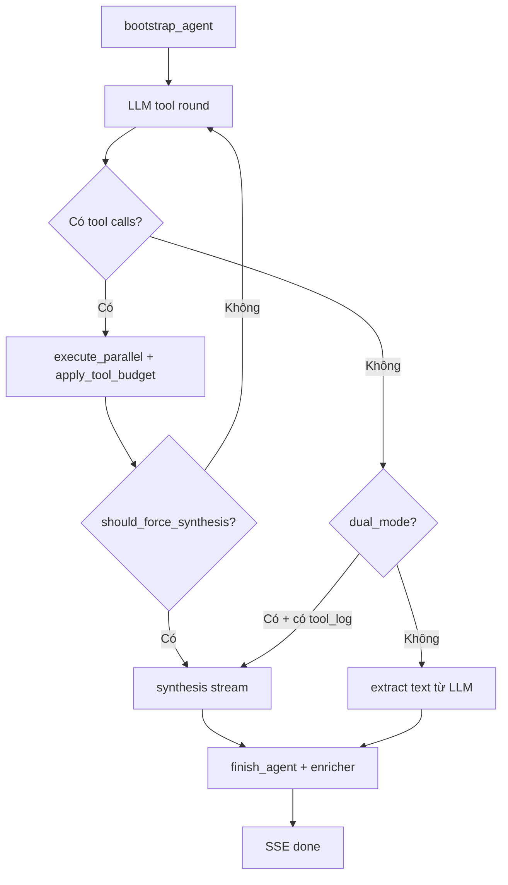
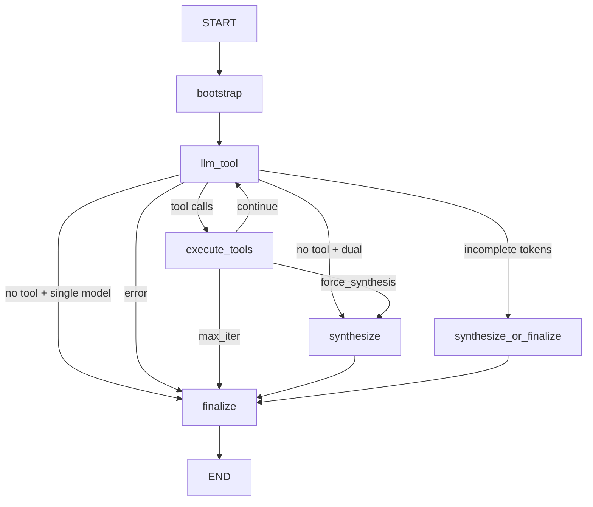

# LangGraph — Hướng dẫn migrate (vừa làm vừa học)

Tài liệu **tự làm** để thay vòng lặp agent hiện tại bằng [LangGraph](https://langchain-ai.github.io/langgraph/).

**Đọc trước:**
- [FLOW.md](./FLOW.md) — luồng end-to-end chatbot → ai-layer → data-miner
- [RAG-GUIDE.md](./RAG-GUIDE.md) — L1/L2/L3, ingest (không đụng khi migrate graph)

**Phạm vi PR:** chỉ `app/services/agent/` (orchestration). **Không** viết lại ingest, RAG pipeline, data-miner client.

**Trạng thái repo (2026-06):**
- Loop legacy: `runner.py`, `stream.py`, `engine.py`, `guards.py` — **đang chạy production**
- LangGraph: `graph/state.py` (có sẵn), `graph/nodes.py` (trống) — **chưa wire vào API**

---

## 0. Bạn sẽ học được gì

Sau khi làm xong lộ trình dưới, bạn nên trả lời được:

1. **State** LangGraph khác `ctx` dict hiện tại thế nào?
2. **Node** nào map sang file Python nào trong repo?
3. **Conditional edge** thay `if/continue` ở đâu trong `stream.py`?
4. Vì sao **không** đưa `executor.py` / ingest vào graph?
5. Stream SSE (`tool_start`, `text_delta`, `done`) map từ graph event ra sao?

---

## 1. LangGraph trong 5 phút

| Khái niệm | Ý nghĩa | Tương đương code hiện tại |
|-----------|---------|---------------------------|
| **State** | Dict typed, merge qua các bước | `ctx` trong `loop.new_context()` |
| **Node** | Hàm async nhận state → trả partial update | Một “bước” trong vòng `for iteration` |
| **Edge** | Chuyển node tiếp theo | `continue` / `return` trong loop |
| **Conditional edge** | Hàm routing trả tên node | `if call_items: ... elif dual_mode: ...` |
| **Reducer** | Gộp list khi nhiều node append | `tool_call_log.extend(...)` |

**While-loop hiện tại** (`stream.py` ~dòng 57–140):

```
bootstrap → [llm → tools? → guards? → synthesis? → done] × max_iter
```

**LangGraph** biến vòng lặp thành **graph có tên**, dễ trace, checkpoint, human-in-the-loop sau này.

---

## 2. Hiện trạng code (cập nhật)

### 2.1 Điểm vào API (giữ nguyên cho chatbot)

| Route | File | Backend |
|-------|------|---------|
| `POST /ai/agent/run` | `app/api/agent.py` | `run_agent()` → `runner.py` |
| `POST /ai/agent/run/stream` | `app/api/agent.py` | `run_agent_stream()` → `stream.py` |

Chatbot proxy: `ai-chatbot/src/app/api/chat/route.ts` → không gửi `max_iter` (dùng `AGENT_MAX_ITER` Supabase).

### 2.2 Luồng legacy chi tiết



### 2.3 File map (quan trọng khi migrate)

| File | Vai trò | Đưa vào graph? |
|------|---------|----------------|
| `platform.py` | Lọc tool, RAG cache-first | Gọi trong node `bootstrap` |
| `loop.py` | Context, tool round helpers | Node gọi helper |
| `engine.py` | `process_agent_step`, `tool_round_action` | **Tái dùng** trong route / node |
| `guards.py` | Search budget, force synthesis | **Tái dùng** trong route `after_tools` |
| `tools.py` | `execute_parallel`, ingest schedule | Node `execute_tools` |
| `synthesis.py` | Synth + fallback model 502 | Node `synthesize` |
| `config.py` | `tool_model()`, `dual_mode()`, `include_review_summary()` | Đọc trong node |
| `stream.py` | SSE mapping | `langgraph_stream.py` (phase sau) |
| `tools/executor.py` | data-miner + RAG thực thi | **Không** — node chỉ gọi |
| `ai/router.py` | `LLM_DEFAULT_PROVIDER=deepseek` | **Không** — node gọi `create_response` |
| `utils/llm_responses.py` | Helper LLM (trước: openai_responses) | Node gọi trực tiếp |

### 2.4 Dict `ctx` → `AgentState`

```python
# loop.new_context() / bootstrap_agent()
{
    "session_id": str,
    "task": str,
    "system": str,
    "tools": list[dict],
    "max_iter": int,
    "input_items": list[dict],
    "tool_call_log": list[dict],
}
# Thêm khi chạy:
{
    "iteration": int,
    "llm_output": Any,      # response LLM vòng hiện tại
    "final_text": str | None,
    "error": str | None,
    "result": dict | None,  # payload sau finish_agent (tùy chọn)
}
```

File mẫu đã có: `app/services/agent/graph/state.py`.

**Reducer `tool_call_log`:** dùng `Annotated[list, operator.add]` nếu mỗi node chỉ **trả entry mới**; nếu vẫn mutate in-place như `complete_tool_round`, reducer không cần.

---

## 3. Hợp đồng SSE (đừng phá chatbot)

`stream.py` emit JSON qua SSE (`data: {...}\n\n`):

| `type` | Khi nào | Payload chính |
|--------|---------|---------------|
| `status` | Bắt đầu / trước synthesis | `detail_vi`, `detail_en` |
| `tool_start` | Trước chạy tool | `tool`, `detail_vi`, `detail_en` |
| `tool_done` | Sau tool xong | `tool` |
| `data_preview` | Có video từ search | `videos[]` |
| `text_delta` | Token stream | `delta` |
| `done` | Kết thúc OK | `data`, `tool_calls` |
| `error` | Lỗi | `message` |

LangGraph phase 1 có thể **chỉ parity sync** (`/run`). Phase 2 mới bắt buộc parity stream.

**Kiểm tra tay:** `curl -N` vào `/ai/agent/run/stream` — thấy đủ event trên.

---

## 4. Graph mục tiêu (8 node — khớp guards hiện tại)

Phiên bản cũ thiếu nhánh **force synthesis** (search budget, max_iter mềm). Graph mới:



| Node | Bọc hàm có sẵn |
|------|----------------|
| `bootstrap` | `bootstrap_agent()` |
| `llm_tool` | `response_stream` / `create_response` + `TASK_AGENT_TOOL` |
| `execute_tools` | `begin_tool_round` + `complete_tool_round` + `apply_tool_budget` (trong complete) |
| `synthesize` | `iter_synthesis_deltas` / `run_synthesis` |
| `finalize` | `finish_agent()` → `enricher` |
| `route_after_llm` | `extract_function_calls`, `dual_mode`, `is_max_tokens_incomplete` |
| `route_after_tools` | `tool_round_action()` từ `engine.py` |

### 4.1 Routing sau LLM (`routes.py`)

```python
def route_after_llm(state: AgentState) -> str:
    if state.get("error"):
        return "finalize"
    response = state["llm_output"]
    if status_error(response):
        return "finalize"
    if is_max_tokens_incomplete(response):
        if config.dual_mode() and state.get("tool_call_log"):
            return "synthesize"
        return "finalize"
    if extract_function_calls(response.output):
        return "execute_tools"
    if config.dual_mode() and state.get("tool_call_log"):
        return "synthesize"
    return "finalize"
```

### 4.2 Routing sau tools

```python
def route_after_tools(state: AgentState) -> str:
    if state["iteration"] >= state["max_iter"]:
        return "finalize"
    if tool_round_action(state, state["iteration"]) == "force_synthesis":
        return "synthesize"
    return "llm_tool"
```

**Học:** `should_force_synthesis` trong `guards.py` — không copy logic sang graph; **import và gọi**.

---

## 5. Lộ trình làm từng bước (có checklist)

### Phase 0 — Spike không đổi hành vi (½ ngày)

**Mục tiêu:** Cài deps, feature flag, graph compile được nhưng vẫn gọi legacy.

1. Thêm vào `requirements.txt`:
   ```text
   langgraph>=0.2.0
   langchain-core>=0.3.0
   ```

2. Env local:
   ```bash
   AGENT_BACKEND=legacy   # mặc định
   ```

3. `app/api/agent.py`:
   ```python
   if getattr(settings, "AGENT_BACKEND", "legacy") == "langgraph":
       from app.services.agent.langgraph_runner import run_agent_langgraph
       ...
   else:
       result = await run_agent(...)
   ```

4. `langgraph_runner.py` tạm:
   ```python
   async def run_agent_langgraph(...):
       return await run_agent(...)  # delegate legacy
   ```

**✅ Xong khi:** `pytest` pass, API `/run` hành vi không đổi.

---

### Phase 1 — State + node sync (1–2 ngày)

**Mục tiêu:** `graph.ainvoke()` chạy được 1 task đơn giản (mock LLM).

#### Bước 1.1 — Hoàn thiện `graph/state.py`

Đã có skeleton. Bổ sung nếu cần:
```python
result: dict  # output finish_agent
text_streamed: bool  # cho stream sau
```

#### Bước 1.2 — `graph/nodes.py` (wrapper mỏng)

Nguyên tắc: **node không chứa business mới** — chỉ gọi hàm cũ.

```python
async def bootstrap_node(state: AgentState) -> dict:
    ctx = await bootstrap_agent(
        state["task"],
        state["tools"],
        state.get("system"),
        state["max_iter"],
    )
    return {
        "session_id": ctx["session_id"],
        "system": ctx["system"],
        "tools": ctx["tools"],
        "input_items": ctx["input_items"],
        "tool_call_log": [],
        "iteration": 0,
    }
```

```python
async def llm_tool_node(state: AgentState) -> dict:
    iteration = state.get("iteration", 0) + 1
    response = await create_response(
        task=TASK_AGENT_TOOL,
        model=config.tool_model(),
        max_output_tokens=config.tool_max_tokens(),
        instructions=state["system"],
        tools=state["tools"],
        tool_choice="auto",
        input=state["input_items"],
    )
    return {"iteration": iteration, "llm_output": response}
```

```python
async def execute_tools_node(state: AgentState) -> dict:
    output = state["llm_output"].output
    # Refactor khuyến nghị: complete_tool_round trả dict mới thay vì mutate state
    call_items = await begin_tool_round(state, output)
    if not call_items:
        return {}
    await complete_tool_round(state, output, state["iteration"])
    return {
        "input_items": state["input_items"],
        "tool_call_log": state["tool_call_log"],
    }
```

```python
async def synthesize_node(state: AgentState) -> dict:
    text = await run_synthesis(
        system=state["system"],
        task=state["task"],
        tool_call_log=state["tool_call_log"],
    )
    return {"final_text": text}
```

```python
async def finalize_node(state: AgentState) -> dict:
    text = state.get("final_text") or extract_response_text(state.get("llm_output"))
    enriched = await finish_agent(
        state,
        iteration=state.get("iteration", 1),
        final_text=text,
    )
    return {"result": enriched, "final_text": text}
```

#### Bước 1.3 — `graph/build.py`

Xem mẫu §6 bên dưới (copy-paste được).

#### Bước 1.4 — Test

`tests/test_agent_graph.py`:
- Mock `create_response` trả 1 `function_call` fake → graph đi `execute_tools` → mock `execute_parallel`
- Mock lần 2 không tool → `finalize`

**✅ Xong khi:** test pass không gọi API thật.

---

### Phase 2 — Immutable state (khuyến nghị, 1 ngày)

**Vấn đề:** `complete_tool_round(ctx, ...)` sửa `ctx` in-place — LangGraph thích partial return.

**Refactor nhỏ trong `loop.py`:**

```python
async def complete_tool_round(...) -> tuple[list, list]:
    outputs, entries = await execute_parallel(...)
    return (
        state["input_items"] + output_items_extension,
        state["tool_call_log"] + entries,
    )
```

Node trả:
```python
return {"input_items": new_items, "tool_call_log": new_log}
```

**✅ Xong khi:** không còn mutate `state` ngoài return dict.

---

### Phase 3 — Parity `/run` sync (1 ngày)

So sánh legacy vs langgraph cùng task (mock hoặc staging):

| Tiêu chí | Cách so |
|----------|---------|
| Cùng tool được gọi | So `tool_calls` trong `done` |
| Cùng số iteration | Log `iteration` |
| Guards hoạt động | Task review → search 1 lần → comments |

**✅ Xong khi:** `AGENT_BACKEND=langgraph` cho `/run` trên staging.

---

### Phase 4 — Stream SSE (2–3 ngày, khó nhất)

Ba chiến lược (giữ từ doc cũ, cập nhật):

| Cách | Mô tả | Giai đoạn |
|------|-------|-----------|
| **B — Hybrid** | Graph route; stream wrapper bọc ngoài gọi `response_stream` | **Làm trước** |
| **A — astream_events** | Map event LangGraph → SSE | Sau khi B parity |
| **C — Stream trong node** | Node yield queue | Tránh trừ khi cần |

**Hybrid (đề xuất):** copy skeleton từ `stream.py`, thay `if should_force_synthesis` bằng `tool_round_action`, thay body loop bằng `graph` chỉ khi đã tự tin.

Pseudo:
```python
async def run_agent_stream_langgraph(...):
    state = await bootstrap_agent(...)
    yield sse_status("Đang phân tích…")
    for iteration in range(1, state["max_iter"] + 1):
        async with response_stream(...) as stream:
            async for event in stream:
                ...
            final = await stream.get_final_response()
        # tool branch → yield tool_start/done (giống stream.py)
        if tool_round_action(...) == "force_synthesis":
            async for delta in iter_synthesis_deltas(...):
                yield sse_text_delta(delta)
            yield sse_done(...)
            return
    ...
```

**✅ Xong khi:** chatbot UI hiển thị giống legacy (tool chips, text, videos).

---

### Phase 5 — Checkpoint + LangSmith (tùy chọn)

```python
from langgraph.checkpoint.postgres.aio import AsyncPostgresSaver

checkpointer = AsyncPostgresSaver.from_conn_string(settings.DATABASE_URL)
graph = builder.compile(checkpointer=checkpointer)

await graph.ainvoke(initial, config={"configurable": {"thread_id": session_id}})
```

Dùng `session_id` từ `loop.new_context()`.

**✅ Xong khi:** resume cùng `thread_id` sau restart process.

---

### Phase 6 — Cutover

1. Soak `AGENT_BACKEND=langgraph` 1–2 tuần
2. Mặc định langgraph
3. Xóa `runner.py` / `stream.py` legacy ở PR riêng (không vội)

---

## 6. Code mẫu `build.py` (đầy đủ hơn)

```python
from langgraph.graph import END, StateGraph

from app.services.agent.graph.nodes import (
    bootstrap_node,
    execute_tools_node,
    finalize_node,
    llm_tool_node,
    synthesize_node,
)
from app.services.agent.graph.routes import route_after_llm, route_after_tools
from app.services.agent.graph.state import AgentState


def build_agent_graph():
    g = StateGraph(AgentState)

    g.add_node("bootstrap", bootstrap_node)
    g.add_node("llm_tool", llm_tool_node)
    g.add_node("execute_tools", execute_tools_node)
    g.add_node("synthesize", synthesize_node)
    g.add_node("finalize", finalize_node)

    g.set_entry_point("bootstrap")
    g.add_edge("bootstrap", "llm_tool")

    g.add_conditional_edges(
        "llm_tool",
        route_after_llm,
        {
            "execute_tools": "execute_tools",
            "synthesize": "synthesize",
            "finalize": "finalize",
        },
    )

    g.add_conditional_edges(
        "execute_tools",
        route_after_tools,
        {
            "llm_tool": "llm_tool",
            "synthesize": "synthesize",
            "finalize": "finalize",
        },
    )

    g.add_edge("synthesize", "finalize")
    g.add_edge("finalize", END)

    return g.compile()
```

`langgraph_runner.py`:

```python
async def run_agent_langgraph(task, tools, max_iter=10, system=None):
    graph = build_agent_graph()
    initial: AgentState = {
        "task": task,
        "tools": tools,
        "max_iter": max_iter,
        "system": system,
    }
    final = await graph.ainvoke(initial)
    if final.get("error"):
        raise RuntimeError(final["error"])
    return final["result"]
```

---

## 7. LLM layer — đừng đổi giữa chừng

Project dùng **Responses-shaped API** qua adapter:

| Hiện tại | LangChain tutorial thường thấy |
|----------|-------------------------------|
| `instructions` + `input_items` | `SystemMessage` + `messages` |
| `function_call` item | `tool_calls` on AIMessage |
| `function_call_output` | `ToolMessage` |

**Node graph gọi:**
```python
from app.utils.llm_responses import create_response, response_stream
from app.ai.router import TASK_AGENT_TOOL, TASK_AGENT_SYNTH
```

Provider hiện tại: `LLM_DEFAULT_PROVIDER=deepseek` (XAH/OpenAI có thể comment trong `providers.py`).

`ConfiguredLLM` chuẩn hóa DeepSeek/XAH → `LLMResponse` (`app/ai/adapters.py`).

**Synthesis fallback 502:** đã có trong `synthesis.py` (`synth_models_to_try`) — node `synthesize` tự hưởng, không cần logic mới.

---

## 8. Config & env

| Nguồn | Ảnh hưởng graph |
|-------|-----------------|
| `AGENT_BACKEND` | `legacy` \| `langgraph` (bạn thêm) |
| Supabase `AI_AGENT` | `max_iter`, `include_review_summary`, limits |
| Supabase `AI_MODELS` | `deepseek.tool_model`, `deepseek.model` |
| `LLM_DEFAULT_PROVIDER` | `.env` — nên `deepseek` |
| `PROMPTS.agent.system` | `bootstrap` → `system` |

LangGraph **không** cần key riêng.

---

## 9. Cấu trúc thư mục đích

```
app/services/agent/
├── engine.py              # routing dùng chung (giữ)
├── guards.py              # budget / force synthesis (giữ)
├── loop.py                # helpers → refactor immutable
├── runner.py              # legacy sync
├── stream.py              # legacy SSE
├── langgraph_runner.py    # NEW — sync entry
├── langgraph_stream.py    # NEW — SSE entry (phase 4)
└── graph/
    ├── state.py           # có sẵn
    ├── nodes.py           # điền dần
    ├── routes.py          # NEW
    └── build.py           # NEW
```

---

## 10. Lỗi thường gặp (và cách học từ đó)

| # | Triệu chứng | Nguyên nhân | Cách sửa |
|---|-------------|-------------|----------|
| 1 | Graph chạy nhưng `tool_call_log` rỗng | Mutate state in-place, không return | Phase 2 immutable |
| 2 | Search loop vô hạn | Không gọi `apply_tool_budget` | Giữ trong `complete_tool_round` |
| 3 | Ép synthesis quá sớm | Route không dùng `guards` | `tool_round_action()` |
| 4 | Chatbot không hiện tool | Thiếu SSE `tool_start` | Parity stream phase 4 |
| 5 | 502 synthesis | Model nặng upstream | Đã có fallback; đổi `model` Supabase |
| 6 | Import LangChain OpenAI | Tutorial khác stack | Chỉ dùng `llm_responses` |

---

## 11. Bài tập tự kiểm (không cần production)

1. Vẽ graph tay trên giấy với task: *"review iPhone 16 pin"* — đánh dấu node nào chạy.
2. Đọc `guards.should_force_synthesis` — liệt kê 3 điều kiện `return True`.
3. Mock test: 1 search + 1 comments_batch → route phải là `finalize` hay `synthesize`?
4. Tìm trong `stream.py` chỗ emit `data_preview` — node graph tương ứng đặt ở đâu?

Đáp án gợi ý: (3) dual_mode + có log → `synthesize`; single model + LLM trả text → `finalize`. (4) Sau `execute_tools`, trước route tiếp.

---

## 12. Thứ tự PR (tóm tắt)

| PR | Nội dung |
|----|----------|
| 1 | Deps + `AGENT_BACKEND` + delegate legacy |
| 2 | `graph/*` + test mock sync |
| 3 | Immutable `complete_tool_round` |
| 4 | Parity `/run` |
| 5 | `langgraph_stream.py` + SSE test |
| 6 | Checkpoint / LangSmith (opt) |
| 7 | Cutover default + xóa legacy (sau) |

---

## 13. Bản đồ file nhanh

| Mối quan tâm | File |
|--------------|------|
| API | `app/api/agent.py` |
| Tool schema | `app/tools/definitions.py`, `rag_definitions.py` |
| Tool exec | `app/tools/executor.py` |
| Platform / RAG filter | `app/services/agent/platform.py` |
| Engine + guards | `app/services/agent/engine.py`, `guards.py` |
| LLM router | `app/ai/router.py` |
| LLM helpers | `app/utils/llm_responses.py` |
| Enricher | `app/services/enricher.py`, `enricher_collect.py` |
| Remote config | Supabase `AI_AGENT`, `AI_MODELS`, `PROMPTS` |

---

## 14. Đọc thêm

- [LangGraph tutorials](https://langchain-ai.github.io/langgraph/tutorials/)
- [Conditional edges](https://langchain-ai.github.io/langgraph/how-tos/graph-api/#add-conditional-edges)
- [Streaming `astream_events`](https://langchain-ai.github.io/langgraph/how-tos/streaming/)
- Nội bộ: [FLOW.md](./FLOW.md) · [RAG-GUIDE.md](./RAG-GUIDE.md)

---

## Phụ lục A — So sánh 1 vòng iteration

**Legacy (`runner.py`):**
```python
response = await create_response(...)
outcome = await process_agent_step(ctx, response, iteration)
if outcome.action == "continue":
    continue
if outcome.action == "force_synthesis":
    return await finish_agent(..., await run_synthesis(...))
```

**LangGraph tương đương:**
```
llm_tool → execute_tools → route_after_tools → llm_tool | synthesize | finalize
```

`process_agent_step` có thể thu gọn thành 2 node (`execute_tools` + route) thay vì 1 node — **tách route ra edge** là điểm học chính của LangGraph.
