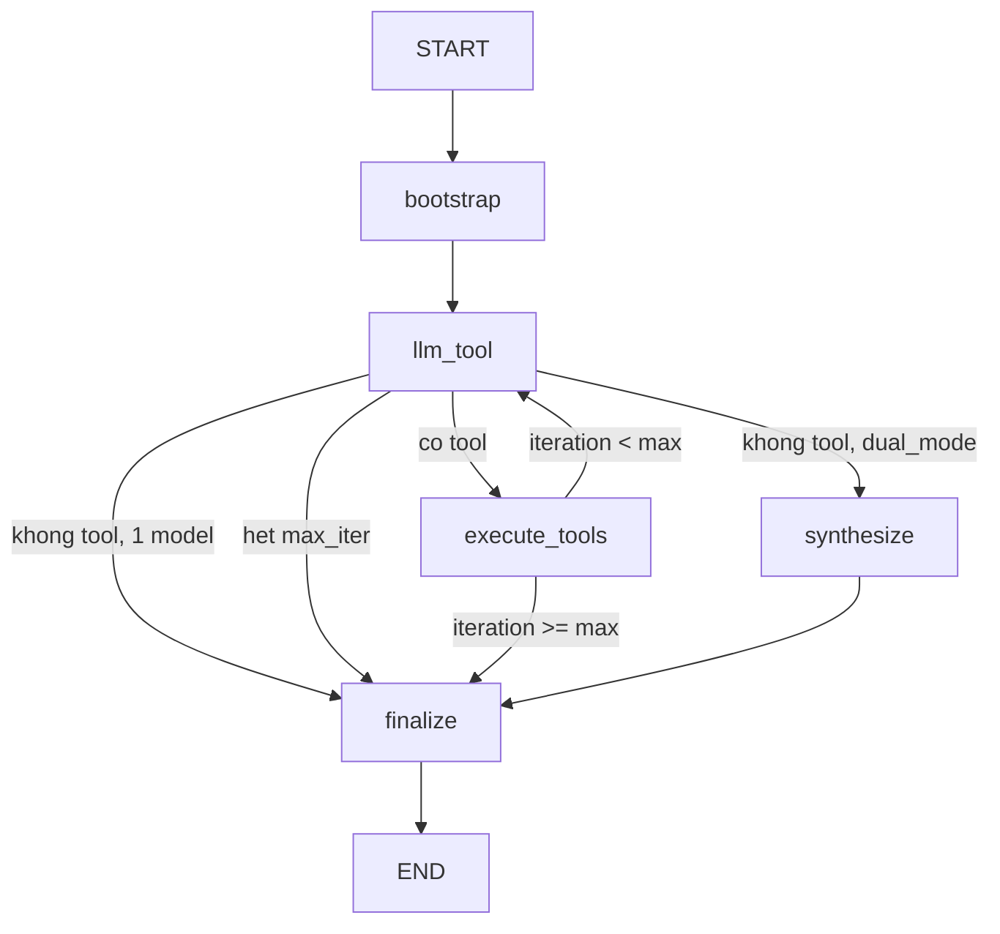

# LangGraph — Hướng dẫn migrate (ai-layer)

Tài liệu **tự làm** để thay vòng lặp agent hiện tại bằng [LangGraph](https://langchain-ai.github.io/langgraph/). Đọc sau [FLOW.md](./FLOW.md) (tổng quan agent) và [RAG-GUIDE.md](./RAG-GUIDE.md) (tầng retrieval).

**Phạm vi:** chỉ orchestration (`services/agent/`). **Không** viết lại ingest, lưu RAG, hay client data-miner trong cùng một PR.

---

## 1. Hiện trạng

### Điểm vào API (giữ nguyên cho ai-chatbot)

| Route | File | Backend hiện tại |
|-------|------|------------------|
| `POST /ai/agent/run` | `app/api/agent.py` | `run_agent()` |
| `POST /ai/agent/run/stream` | `app/api/agent.py` | `run_agent_stream()` |

Chatbot kỳ vọng **SSE** các event: `status`, `tool_start`, `tool_done`, `data_preview`, `text_delta`, `done`, `error`. Hợp đồng này nằm ở `app/services/agent/stream.py`.

### Vòng lặp custom (phần bạn thay thế)

```
bootstrap_agent (lọc platform, RAG cache-first)
  → for iteration in 1..max_iter:
       gọi LLM (Responses API, TASK_AGENT_TOOL)
       → có tool calls? execute_parallel + schedule_tool_ingest → tiếp tục
       → không tool, dual_mode? run_synthesis → finish_agent
       → không tool, một model? extract text → finish_agent
```

| File | Vai trò |
|------|---------|
| `loop.py` | Shape context, bootstrap, vòng tool, nhánh synthesis |
| `runner.py` | Vòng lặp đồng bộ |
| `stream.py` | Cùng logic + map sang SSE |
| `platform.py` | Lọc tool (YouTube/TikTok, block sản phẩm, RAG cache) |
| `tools.py` | Chạy tool song song + schedule ingest |
| `synthesis.py` | Lượt model thứ hai khi `dual_mode()` |
| `finalize.py` | Bọc `enricher.py` |
| `config.py` | Model / token từ `LLMRouter` |

### Dict context (map 1:1 sang LangGraph state)

```python
{
    "session_id": str,
    "task": str,
    "system": str,
    "tools": list[dict],       # schema tool Responses API
    "max_iter": int,
    "iteration": int,          # nên khai báo rõ trong graph
    "input_items": list[dict], # hội thoại Responses API
    "tool_call_log": list[dict],
    "final_text": str | None,
    "error": str | None,
}
```

Tạo trong `loop.new_context()` / `bootstrap_agent()`.

### Không đưa vào graph

| Giữ nguyên | Lý do |
|------------|-------|
| `tools/executor.py`, `definitions.py`, `rag_definitions.py` | Implementation tool |
| `ingest/dispatcher/schedule.py` | RabbitMQ nền |
| `enricher.py` | Hậu xử lý payload `done` |
| `ai/providers.py`, `ai/router.py` | Provider LLM |
| `utils/openai_responses.py` | Helper Responses API |

Node LangGraph **gọi** các module này; không copy logic vào file graph.

---

## 2. Khi nào nên dùng LangGraph

Nên migrate khi cần **ít nhất hai** mục sau:

- Nhánh rõ ràng (RAG đủ → trả lời / crawl / hỏi lại user)
- Checkpoint / resume sau crash hoặc run dài
- Human-in-the-loop (duyệt crawl, xác nhận sản phẩm)
- Quan sát từng node (LangSmith, chi phí token từng bước)
- Nhánh song song (ví dụ YouTube + TikTok rồi gộp)

Nếu chỉ cần “gọi tool đến khi xong”, while-loop hiện tại đơn giản hơn và đã khớp OpenAI Responses API.

---

## 3. Graph mục tiêu (đề xuất 6 node)



| Node | Bọc code có sẵn |
|------|-----------------|
| `bootstrap` | `bootstrap_agent()` |
| `llm_tool` | `create_response` / `response_stream_with_retry` với `TASK_AGENT_TOOL` |
| `execute_tools` | `run_tool_round()` hoặc `begin_tool_round` + `complete_tool_round` |
| `synthesize` | `run_synthesis()` / `iter_synthesis_deltas()` |
| `finalize` | `finish_agent()` |
| `route` | cạnh có điều kiện: tool calls, `dual_mode()`, `max_iter` |

Làm graph này trước khi thêm node RAG riêng (`rag_lookup`, `coverage_gate`, …).

---

## 4. Dependencies

Thêm vào `requirements.txt` (pin version trên nhánh spike):

```text
langgraph>=0.2.0
langchain-core>=0.3.0
```

**Không bắt buộc** dùng LangChain OpenAI wrapper nếu node vẫn gọi `get_router().create_response()` trực tiếp.

Tùy chọn:

```text
langgraph-checkpoint-postgres>=2.0.0   # resume session
langsmith>=0.1.0                       # tracing
```

---

## 5. Các bước triển khai

### Bước 0 — Feature flag

Thêm env (chỉ local lúc đầu):

```bash
AGENT_BACKEND=legacy   # mặc định
# AGENT_BACKEND=langgraph
```

Trong `app/api/agent.py`:

```python
if settings.AGENT_BACKEND == "langgraph":
    from app.services.agent.langgraph_runner import run_agent_langgraph
    result = await run_agent_langgraph(...)
else:
    result = await run_agent(...)
```

Giữ flag cho đến khi stream đạt parity với legacy.

### Bước 1 — Kiểu state

Tạo `app/services/agent/graph/state.py`:

```python
from typing import Annotated, Any, TypedDict
import operator

class AgentState(TypedDict, total=False):
    session_id: str
    task: str
    system: str
    tools: list[dict]
    max_iter: int
    iteration: int
    input_items: list[dict]
    tool_call_log: Annotated[list[dict], operator.add]
    llm_output: Any
    final_text: str
    error: str
```

Chỉ dùng `Annotated[..., operator.add]` khi nhiều node append `tool_call_log` trong một bước.

### Bước 2 — Node

Tạo `app/services/agent/graph/nodes.py`. Mỗi node là wrapper mỏng:

```python
async def bootstrap_node(state: AgentState) -> dict:
    ctx = await bootstrap_agent(
        state["task"], state["tools"], state.get("system"), state["max_iter"]
    )
    return {
        "session_id": ctx["session_id"],
        "system": ctx["system"],
        "tools": ctx["tools"],
        "input_items": ctx["input_items"],
        "tool_call_log": [],
        "iteration": 0,
    }

async def llm_tool_node(state: AgentState) -> dict:
    iteration = state["iteration"] + 1
    response = await create_response(
        task=TASK_AGENT_TOOL,
        model=config.tool_model(),
        max_output_tokens=config.tool_max_tokens(),
        instructions=state["system"],
        tools=state["tools"],
        tool_choice="auto",
        input=state["input_items"],
    )
    return {"iteration": iteration, "llm_output": response}
```

Tái dùng `is_max_tokens_incomplete`, `status_error`, `extract_function_calls` từ module hiện có.

### Bước 3 — Node tool

```python
async def execute_tools_node(state: AgentState) -> dict:
    output = state["llm_output"].output
    call_items = await begin_tool_round(state, output)
    if not call_items:
        return {}
    await complete_tool_round(state, output, state["iteration"])
    return {
        "input_items": state["input_items"],
        "tool_call_log": state["tool_call_log"],  # hiện mutate in-place — nên đổi sang immutable
    }
```

**Gợi ý refactor:** cho `complete_tool_round` **trả về** `input_items` / `tool_call_log` mới thay vì sửa `ctx` — LangGraph sạch hơn với state bất biến.

### Bước 4 — Routing

```python
def after_llm(state: AgentState) -> str:
    if state.get("error"):
        return "finalize"
    response = state["llm_output"]
    if is_max_tokens_incomplete(response):
        return "synthesize" if config.dual_mode() and state["tool_call_log"] else "finalize"
    if extract_function_calls(response.output):
        return "execute_tools"
    if config.dual_mode() and state["tool_call_log"]:
        return "synthesize"
    return "finalize"

def after_tools(state: AgentState) -> str:
    if state["iteration"] >= state["max_iter"]:
        return "finalize"
    return "llm_tool"
```

### Bước 5 — Compile graph

Tạo `app/services/agent/graph/build.py`:

```python
from langgraph.graph import END, StateGraph
from .nodes import bootstrap_node, llm_tool_node, execute_tools_node, synthesize_node, finalize_node
from .routes import after_llm, after_tools

def build_agent_graph():
    g = StateGraph(AgentState)
    g.add_node("bootstrap", bootstrap_node)
    g.add_node("llm_tool", llm_tool_node)
    g.add_node("execute_tools", execute_tools_node)
    g.add_node("synthesize", synthesize_node)
    g.add_node("finalize", finalize_node)
    g.set_entry_point("bootstrap")
    g.add_edge("bootstrap", "llm_tool")
    g.add_conditional_edges("llm_tool", after_llm, {
        "execute_tools": "execute_tools",
        "synthesize": "synthesize",
        "finalize": "finalize",
    })
    g.add_conditional_edges("execute_tools", after_tools, {
        "llm_tool": "llm_tool",
        "finalize": "finalize",
    })
    g.add_edge("synthesize", "finalize")
    g.add_edge("finalize", END)
    return g.compile()
```

### Bước 6 — Runner đồng bộ

`app/services/agent/langgraph_runner.py`:

```python
async def run_agent_langgraph(task, tools, max_iter=10, system=None):
    graph = build_agent_graph()
    initial = {"task": task, "tools": tools, "max_iter": max_iter, "system": system}
    final = await graph.ainvoke(initial)
    if final.get("error"):
        raise RuntimeError(final["error"])
    return final["result"]  # shape từ finish_agent
```

Gọi `finish_agent` trong `finalize_node` và lưu `result` lên state.

### Bước 7 — Streaming (phần khó)

`stream.py` hiện xen kẽ token LLM + trạng thái tool. Ba hướng:

| Cách | Ưu | Nhược |
|------|-----|-------|
| **A. `graph.astream_events(v2)`** | Streaming chính thức LangGraph | Phải map nhiều event → SSE của bạn |
| **B. Stream trong node `llm_tool` / `synthesize`** | Tái dùng `response_stream_with_retry` | Graph tạm dừng khi stream; tự yield event |
| **C. Hybrid** | Graph chỉ routing; wrapper stream bên ngoài | Ít “thuần” LangGraph |

**Đề xuất cho codebase này:** làm **B** trước.

```python
async def run_agent_stream_langgraph(...):
    ctx = await bootstrap_agent(...)
    # yield SSE status
    for iteration in range(1, max_iter + 1):
        async with response_stream_with_retry(...) as stream:
            async for event in stream:
                if event.type == "response.output_text.delta":
                    yield sse_text_delta(event.delta)
            final = await stream.get_final_response()
        # nhánh tool → yield tool_start / tool_done (copy từ stream.py)
        # route giống hiện tại
    yield sse_done(...)
```

Khi đã parity, dần chuyển routing sang `astream_events`.

### Bước 8 — Adapter OpenAI Responses API

Tutorial LangGraph thường dùng Chat Completions + `bind_tools`. Project này dùng **Responses API** (`input_items`, `function_call_output`).

| Responses API (hiện tại) | LangChain/LangGraph thường gặp |
|--------------------------|--------------------------------|
| `instructions` + `input` | `system` + `messages` |
| item `function_call` | `tool_calls` trên AIMessage |
| `function_call_output` | `ToolMessage` |

**Đừng đổi format API giữa chừng migrate.** Tiếp tục gọi:

- `get_router().create_response(task=TASK_AGENT_TOOL, ...)`
- `get_router().response_stream(task=TASK_AGENT_TOOL, ...)`

DeepSeek/XAH đã chuẩn hóa qua `app/ai/adapters.py` → `LLMResponse`. OpenAI dùng Responses native. Node graph nên phụ thuộc `LLMResponse` + `openai_responses.py`, không phụ thuộc type SDK thô.

### Bước 9 — Checkpoint (tùy chọn, giai đoạn 2)

Khi cần resume:

```python
from langgraph.checkpoint.postgres.aio import AsyncPostgresSaver

checkpointer = AsyncPostgresSaver.from_conn_string(settings.DATABASE_URL)
graph = builder.compile(checkpointer=checkpointer)

await graph.ainvoke(
    initial,
    config={"configurable": {"thread_id": session_id}},
)
```

Dùng cùng `session_id` như `loop.new_context()`. Lưu `thread_id` trong chat history nếu user tiếp tục session cũ.

### Bước 10 — Test

| Test | File |
|------|------|
| Route graph (mock LLM) | `tests/test_agent_graph.py` |
| Thứ tự event SSE | `tests/test_agent_stream.py` |
| Lọc tool không đổi | `tests/test_core.py` (có sẵn) |
| Parity legacy vs langgraph | cùng task → cùng tên tool được gọi |

Mock tại `create_response` / `execute_tool`, không mock sâu trong thư viện graph.

---

## 6. Cấu trúc thư mục sau migrate

```
app/services/agent/
├── loop.py              # giữ đến khi cutover; helper dùng chung
├── runner.py            # backend legacy
├── stream.py            # SSE legacy
├── langgraph_runner.py  # entry đồng bộ mới
├── langgraph_stream.py  # entry SSE mới
├── graph/
│   ├── state.py
│   ├── nodes.py
│   ├── routes.py
│   └── build.py
└── ...                  # platform, tools, synthesis giữ nguyên
```

---

## 7. Env / config

LangGraph **không** cần thêm key Supabase.

| Env | Mục đích |
|-----|----------|
| `AGENT_BACKEND` | `legacy` \| `langgraph` (bạn tự thêm) |
| `AGENT_MAX_ITER` | Supabase `AI_AGENT` — vẫn dùng |
| `OPENAI_*`, `DEEP_SEEK_*` | Supabase `AI_MODELS` — model tool vs synth |
| `LANGSMITH_API_KEY` | Tracing (tùy chọn) |
| `LANGSMITH_PROJECT` | Tracing (tùy chọn) |

Prompt vẫn từ Supabase `PROMPTS` → `AGENT_SYSTEM`, `AGENT_SYNTH_SYSTEM`.

---

## 8. Lỗi thường gặp

1. **Mutate dict `ctx`** — LangGraph cần partial state trả về; refactor helper trong `loop.py` để return thay vì sửa in-place.
2. **Dual-model** — `config.dual_mode()` khi provider tool ≠ synth; synthesis là node riêng, không nhét thêm LLM call trong `llm_tool`.
3. **RAG cache-first** — vẫn trong `bootstrap_agent` / `platform.py`; chạy trước khi graph bắt đầu.
4. **Ingest** — giữ `schedule_tool_ingest` trong `execute_parallel`; đừng tách job async nếu chưa test `product_hint`.
5. **SSE song ngữ** — `tool_status.py` giữ nguyên; chỉ map ở lớp stream.
6. **Viết lại ingest/RAG** — ngoài phạm vi; xem [RAG-GUIDE.md](./RAG-GUIDE.md).

---

## 9. Thứ tự PR đề xuất

1. Flag `AGENT_BACKEND` + `langgraph_runner` rỗng delegate về legacy (không đổi hành vi).
2. `graph/state.py`, `graph/nodes.py` + unit test; chỉ đường sync.
3. Parity stream: `text_delta` + `tool_start` / `tool_done` + `done`.
4. Gom helper routing dùng chung giữa `runner.py` và `langgraph_runner`.
5. Tùy chọn: Postgres checkpointer + LangSmith.
6. Mặc định `AGENT_BACKEND=langgraph` sau soak; xóa loop legacy ở PR sau.

---

## 10. Bản đồ code nhanh

| Mối quan tâm | File |
|--------------|------|
| Route API | `app/api/agent.py` |
| Schema tool | `app/tools/definitions.py`, `rag_definitions.py` |
| Dispatch tool | `app/tools/executor.py` |
| Lọc platform / RAG | `app/services/agent/platform.py` |
| Routing LLM | `app/ai/router.py` |
| Helper Responses | `app/utils/openai_responses.py` |
| Response enrich | `app/services/enricher.py` |
| Giới hạn agent remote | Supabase `AI_AGENT`, `AI_MODELS`, `PROMPTS` |

---

## 11. Đọc thêm

- [LangGraph tutorials](https://langchain-ai.github.io/langgraph/tutorials/)
- [Streaming với `astream_events`](https://langchain-ai.github.io/langgraph/how-tos/streaming/)
- Nội bộ: [FLOW.md](./FLOW.md) · [RAG-GUIDE.md](./RAG-GUIDE.md) · mục roadmap trong README
