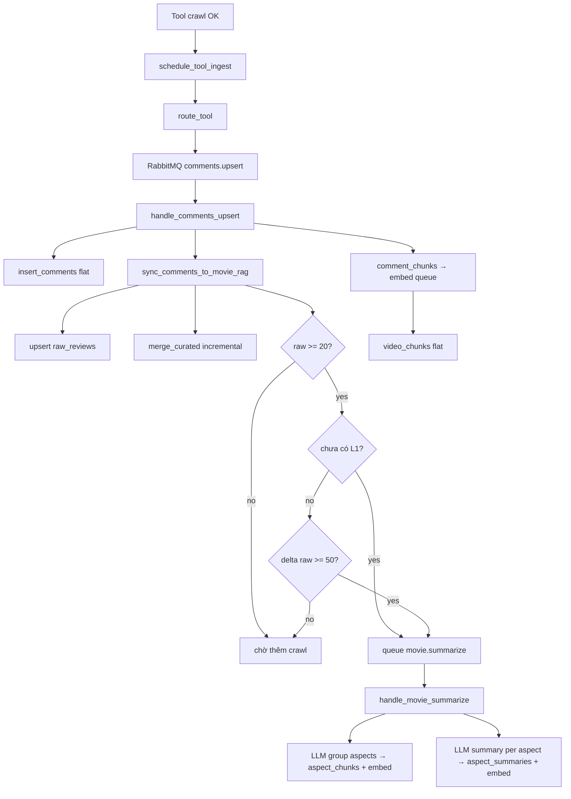

# RAG — Luồng chi tiết (ai-layer)

Tài liệu **trạng thái hiện tại** của pipeline Agentic RAG — dùng khi **vừa làm vừa học**, debug, hoặc nâng cấp.

Tóm tắt stack: [FLOW.md](./FLOW.md) · LangGraph (riêng, không đụng RAG): [LANGGRAPH-GUIDE.md](./LANGGRAPH-GUIDE.md) · Migration: `alembic/versions/`

**Phạm vi:** review phim từ YouTube/TikTok (`ai-chatbot` → `ai-layer` → `data-miner`). Không bao gồm movie API / cine-flow.

---

## 0. Lộ trình vừa làm vừa học

Đọc theo thứ tự — mỗi bước có **mục tiêu học** và **cách tự kiểm tra**.

| Bước | Làm gì | Đọc mục | Biết khi nào xong |
|------|--------|---------|-------------------|
| 1 | Bật Postgres + pgvector, chạy Alembic | §7.3 | `alembic current` = head |
| 2 | Bật RabbitMQ + `INGEST_*` + `RAG_ENABLED=true` | §8 | `GET /health` OK |
| 3 | Chạy ai-layer + data-miner | [FLOW.md § Chạy dev](./FLOW.md#chạy-dev) | API `:8001` lên |
| 4 | Gửi 1 task có `[Phim đang xem]` từ chatbot | §5.1 | Log agent + tool crawl |
| 5 | Theo dõi ingest → `raw_reviews` tăng | §6.2–6.3 | SQL `COUNT(*)` > 0 |
| 6 | Đợi summarize khi `raw >= 20` | §6.3, §6.5 | Log `[summarize] done` |
| 7 | Hỏi lại cùng phim | §5.2, §5.4 | Log `[agent] RAG cache hit` |
| 8 | Debug khi lệch | §11–12 | `coverage` + SQL khớp kỳ vọng |

**3 câu hỏi nên trả lời được sau bước 7:**

1. Vì sao lần đầu agent **crawl**, lần sau chỉ **4 tool RAG**?
2. `movie_has_knowledge` và `is_movie_fresh` khác nhau thế nào?
3. `coverage=partial` agent nên gọi L2 hay crawl?

---

## 1. Mục tiêu

Agent **không** đọc hàng nghìn comment mỗi lần hỏi. Thay vào đó:

1. **L3** — lưu review gốc (YouTube/TikTok) theo `movie_id`
2. **Curated** — lọc spam, sort likes, giữ top N
3. **L2** — LLM nhóm curated theo aspect → `aspect_chunks` + embedding
4. **L1** — LLM tóm tắt từng aspect → `aspect_summaries` + embedding

Khi user hỏi, agent gọi tool **L1 trước** → drill-down L2/L3 nếu `coverage` chưa đủ → crawl thêm nếu RAG trống.

**Nguồn review:** chỉ YouTube + TikTok (qua data-miner). Giá Tiki/FPT chatbot nhét vào prompt — **không** ingest TMĐT.

---

## 2. Hai track dữ liệu song song

Mỗi lần crawl comment chạy **hai nhánh** trong `handlers/comments.py`:

| Track | Bảng | Mục đích |
|-------|------|----------|
| **Flat** | `videos`, `comments`, `video_chunks` | Cache video/comment; embed transcript/comment chunks (search phẳng theo video) |
| **Movie RAG** | `movies`, `raw_reviews`, `curated_reviews`, `aspect_chunks`, `aspect_summaries` | Review theo phim; agent tool L1/L2/L3 |

```
Crawl comment OK
  ├─ FLAT:  insert_comments → comment_chunks → queue embed → video_chunks
  └─ RAG:   sync_comments_to_movie_rag → raw + curated → (đủ điều kiện) queue summarize
```

RAG chỉ chạy khi envelope có **`movie_hint`** (tên SP từ task chatbot). Không có hint → chỉ flat track.

---

## 3. Ba tầng retrieval (L1 / L2 / L3)

| Tầng | Bảng | Nội dung | Tool agent | Vector? |
|------|------|----------|------------|---------|
| **L1** | `aspect_summaries` | Tóm tắt pros/cons theo aspect | `search_movie_summary` | Có (HNSW) |
| **L2** | `aspect_chunks` | Nhóm review gốc theo aspect | `search_aspect_evidence` | Có (HNSW) |
| **L3** | `raw_reviews` | Comment nguyên văn, sort likes | `get_raw_reviews` | Không |

**Curated** (`curated_reviews`) không phải tầng search — là bước trung gian trước LLM summarize.

**Aspect chuẩn** (dùng trong summarize + tool schema):

`battery`, `camera`, `screen`, `performance`, `design`, `price`, `software`, `durability`, `other`

---

## 4. Sơ đồ end-to-end

### 4.1 Đọc — user hỏi → câu trả lời


### 4.2 Ghi — crawl → RAG đầy đủ



---

## 5. Đọc — chi tiết từng bước

### 5.1 Task từ chatbot

Khi user bấm **AI Review** trên panel phim, chatbot gửi task có block:

```
[Phim đang xem]
Tên: iPhone 17 Pro
movie_id: dune-part-two
Giá: ...
[Câu hỏi hiện tại]
Review phim này giúp tôi
```

- `extract_movie_name()` (`app/rag/movie_hint.py`) lấy tên từ dòng `Tên:` hoặc quote trong câu hỏi
- `slugify_movie_id()` (`app/ingest/mappers/social_review.py`) → `dune-part-two`
- Chatbot build task: `ai-chatbot/src/lib/ai-layer/utils.ts` — **phải khớp** logic slug với ai-layer

### 5.2 Lọc tool trước OpenAI — `prepare_tools_for_task()`

File: `app/services/agent/tooling/platform.py` — gọi từ `app/services/agent/core/context.py` → `bootstrap_agent()`.

Thứ tự lọc:

| Bước | Điều kiện | Kết quả |
|------|-----------|---------|
| 1. Platform | Câu hỏi chỉ nhắc YouTube hoặc TikTok | Bỏ tool nền kia (`youtube_*` / `tiktok_*`) |
| 2a. Review query | Câu hỏi dạng review, **không** có block phim | Thu tool → `_MOVIE_CORE` (~9) |
| 2b. Product context | Có `[Phim đang xem]` và không chỉ định nền | Thu ~27 tool → **9** (`_MOVIE_CORE`) |
| 3. **Cache-first** | `RAG_ENABLED` + có knowledge + **còn fresh** | Chỉ **4 tool** (`_RAG_CACHE_TOOLS`) |

`_MOVIE_CORE` (9 tool): 3 RAG + `youtube_search`, `youtube_get_comments`, `youtube_get_comments_batch`, `youtube_get_transcript_batch`, `youtube_get_detail`, `extract_id_from_url`.

`_RAG_CACHE_TOOLS` (4 tool): 3 RAG + `extract_id_from_url`.

**Cache-first** (`app/rag/knowledge.py`) — cần **cả hai** hàm:

| Hàm | Điều kiện | Ghi chú |
|-----|-----------|---------|
| `movie_has_knowledge` | Có row L1 **hoặc** curated ≥ 20 | Chỉ curated (chưa L1) → **chưa** cache-first |
| `is_movie_fresh` | **Bắt buộc có L1** và `updated_at` trong `CACHE_TTL_DAYS` | Mặc định 7 ngày |

→ Agent **không** nhận tool crawl khi đã có L1, còn trong TTL, và `RAG_ENABLED=true`.

### 5.3 Tool RAG — schema & executor

Định nghĩa: `app/tools/rag_definitions.py`  
Thực thi: `app/tools/executor.py` (khi `RAG_ENABLED=true`)

| Tool | Gọi hàm | Input chính |
|------|---------|-------------|
| `search_movie_summary` | `rag/search.search_aspect_summary` | `movie_id`, `query`, `aspect?` |
| `search_aspect_evidence` | `rag/search.search_aspect_evidence` | `movie_id`, `query`, `aspect?` |
| `get_raw_reviews` | `rag/search.get_raw_reviews` | `movie_id`, `limit?` |

### 5.4 Retrieval & `coverage`

File orchestration: `app/rag/search.py`  
Vector SQL: `repositories/aspect_summaries.search_similar_summaries`, `repositories/aspect_chunks.search_similar_chunks`

Luồng L1/L2:

1. `embed_texts([query])` — OpenAI `text-embedding-3-small`, dim = `EMBEDDING_DIM`
2. Cosine search pgvector: `ORDER BY embedding <=> query_vec LIMIT k`
3. Score = `1 - distance`; best score quyết định coverage:

| `coverage` | Ý nghĩa | Agent nên |
|------------|---------|-----------|
| `sufficient` | best score ≥ `RAG_MIN_SCORE` (0.65) | Trả lời từ kết quả |
| `partial` | Có item nhưng score thấp | Gọi L2 hoặc aspect cụ thể |
| `none` | Không có row / không embed | Crawl YouTube/TikTok |

L3: sort `likes DESC`, không vector — `coverage` = `sufficient` nếu có row.

**Gợi ý prompt agent** (Supabase `AGENT_SYSTEM`): L1 → L2 → L3 → crawl khi `none`.

### 5.5 Sau mỗi tool crawl — ingest nền

`app/services/agent/tooling/dispatch.py` → `schedule_tool_ingest()` sau mỗi tool thành công.

`movie_hint` = `extract_movie_name(task)` (tối đa 120 ký tự).

Tool được route (`ingest/dispatcher/routes.py`):

| Tool | Job RabbitMQ |
|------|----------------|
| `youtube_search`, `tiktok_search` | search cache |
| `youtube_get_comments`, `*_batch` | `comments.upsert` |
| `youtube_get_transcript`, `*_batch` | `transcript.upsert` |
| `tiktok_comments`, `tiktok_transcript` | comments / transcript |
| `youtube_get_detail`, `tiktok_video_info` | `video.upsert` |

---

## 6. Ghi — chi tiết từng bước

### 6.1 RabbitMQ topology

File: `ingest/schemas.py`, `ingest/broker/topology.py`

| Routing key | Queue | Handler |
|-------------|-------|---------|
| `video.upsert` | `ingest.video` | `handlers/video.py` |
| `comments.upsert` | `ingest.comments` | `handlers/comments.py` |
| `transcript.upsert` | `ingest.transcript` | `handlers/transcript.py` |
| `chunks.embed` | `ingest.embed` | `handlers/embed.py` |
| `movie.summarize` | `ingest.summarize` | `handlers/summarize.py` |

Exchange: `knowledge.ingest` · DLX: `knowledge.ingest.dlx` · DLQ: `ingest.dlq`

Consumer (`ingest/consumer/worker.py`): retry tối đa 3 lần → reject vào DLQ.

Chạy worker:

```bash
# Cùng process API (dev)
INGEST_WORKER_INLINE=true

# Process riêng
python -m app.ingest
```

### 6.2 `handle_comments_upsert` — dual track

File: `app/ingest/handlers/comments.py`

1. `upsert_video` nếu video chưa có
2. `insert_comments` → bảng `comments` (flat)
3. **`sync_comments_to_movie_rag`** (nếu có `movie_hint`)
4. `comment_chunks` → publish `chunks.embed` → `video_chunks`

### 6.3 `sync_comments_to_movie_rag`

File: `app/ingest/processing/rag_sync.py`

```
movie_hint → slugify_movie_id
→ upsert movies
→ map_social_raw_review (từng comment) → upsert raw_reviews
→ merge_curated(existing, batch_mới)   # incremental, không load 10k raw
→ replace_curated_reviews
→ nếu đủ điều kiện: publish movie.summarize
```

**Điều kiện queue summarize** (`_should_queue_summarize` trong `rag_sync.py`):

| Tình huống | Điều kiện |
|------------|-----------|
| Chưa đủ raw | `count(raw_reviews) < 20` → **không** queue |
| Lần đầu (chưa có L1) | `raw >= 20` → queue summarize |
| Đã có L1 | `raw - last_summarize_raw_count >= 50` → queue lại |

### 6.4 Curate & quality

| File | Vai trò |
|------|---------|
| `ingest/processing/quality.py` | `is_indexable_comment` — min 6 ký tự, không spam, ≥ 3 alphanumeric |
| `ingest/processing/curate.py` | `curate_review_rows` — lọc + sort likes + top `AGENT_CURATED_TOP_N` |
| `ingest/processing/curate.py` | `merge_curated` — gộp batch mới với curated hiện có |

### 6.5 `handle_movie_summarize` — L2 + L1

File: `app/ingest/handlers/summarize.py`

```
curated_reviews (top AGENT_CURATED_TOP_N, mặc định 300)
  → LLM group aspects — tối đa 200 review gửi LLM (_MAX_CURATED_FOR_LLM)
  → aspect_chunks rows
  → embed_texts(chunk content) → upsert aspect_chunks
  → per aspect: LLM summary (ASPECT_SUMMARY_*) → embed summary → upsert aspect_summaries
  → cập nhật movies.metadata.last_summarize_raw_count
```

Prompts ingest LLM: `app/services/prompts.py` (`ASPECT_GROUP_*`, `ASPECT_SUMMARY_*`) — **hardcoded repo**, khác `AGENT_SYSTEM` (Supabase).

Fallback: nếu LLM group fail → gom tất cả vào aspect `other`.

### 6.6 Embedding

File: `app/ingest/processing/embeddings.py`

- Model: `EMBEDDING_MODEL` (default `text-embedding-3-small`)
- Dim: `EMBEDDING_DIM` (default `1536`) — khớp `app/config/db/models/vector_dim.py`
- Batch 64 texts/lần

---

## 7. Schema Postgres

Tất cả qua `DATABASE_URL` (Supabase Postgres + pgvector). Supabase REST dùng cho auth + `config`.

### 7.1 Movie RAG

```text
movies
  id (PK, slug), name, platform, metadata JSONB

raw_reviews (L3)
  id, movie_id FK, source, source_video_id, content, likes, ...

curated_reviews
  id, movie_id FK, raw_review_id FK, rank, likes, content

aspect_chunks (L2)
  id, movie_id FK, aspect, content, review_ids JSONB, embedding VECTOR

aspect_summaries (L1)
  id, movie_id FK, aspect, summary, pros/cons JSONB, embedding VECTOR
  UNIQUE (movie_id, aspect)
```

Index HNSW trên `embedding` (cosine) cho L1/L2.

### 7.2 Flat (song song)

```text
videos, comments, video_chunks (embedding), search_cache
chat_sessions, chat_messages
```

### 7.3 Migration (Alembic)

```bash
# DB mới
alembic upgrade head

# DB đã có bảng từ init_db() — một lần
alembic stamp head

# Sau khi đổi models
alembic revision --autogenerate -m "mô tả"
alembic upgrade head
```

Revision hiện tại: `alembic/versions/90c66f03b10a_initial_schema.py`

---

## 8. Config & biến môi trường

Config ai-layer có **hai nguồn** (xem `config/remote-schema.json` + `app/config/loader.py`):

1. **Supabase bảng `config`** — ưu tiên prod (`SERVICES`, `AI_AGENT`, `AI_MODELS`, `PROMPTS`)
2. **Env local** — fallback khi giá trị remote trống / `false` / `0`

### 8.1 RAG & ingest (env hoặc Supabase `SERVICES`)

| Biến settings | Supabase path | Default nếu không set | Ý nghĩa |
|---------------|---------------|----------------------|---------|
| `RAG_ENABLED` | `SERVICES.rag.enabled` | **`false`** | Bật tool RAG + executor — **phải bật tay** |
| `RAG_TOP_K` | `SERVICES.rag.top_k` | `0` → dùng logic code | Số kết quả vector search (khuyến nghị `8`) |
| `RAG_MIN_SCORE` | `SERVICES.rag.min_score` | `0` → dùng logic code | Ngưỡng `coverage=sufficient` (khuyến nghị `0.65`) |
| `CACHE_TTL_DAYS` | `SERVICES.cache.ttl_days` | `0` | Fresh cho cache-first (khuyến nghị `7`) |
| `INGEST_ENABLED` | `SERVICES.ingest.enabled` | `false` | Publish RabbitMQ |
| `INGEST_WORKER_INLINE` | `SERVICES.ingest.worker_inline` | `false` | Worker trong process API (dev: `true`) |
| `RABBITMQ_URL` | `SERVICES.rabbitmq.url` | — | Bắt buộc nếu ingest bật |
| `EMBEDDING_MODEL` | `SERVICES.embedding.model` | — | Model embed |
| `EMBEDDING_DIM` | `SERVICES.embedding.dim` | — | Chiều vector (`1536`) |

**Local dev tối thiểu** (thêm vào `.env` — xem `.env.example`):

```bash
RAG_ENABLED=true
RAG_TOP_K=8
RAG_MIN_SCORE=0.65
CACHE_TTL_DAYS=7
INGEST_ENABLED=true
INGEST_WORKER_INLINE=true
```

### 8.2 Agent limits (env hoặc Supabase `AI_AGENT`)

| Biến settings | Supabase path | Default | Ý nghĩa |
|---------------|---------------|---------|---------|
| `AGENT_CURATED_TOP_N` | `AI_AGENT.curated_top_n` | `300` | Top curated lưu DB + đưa vào summarize |
| `AGENT_MAX_ITER` | `AI_AGENT.max_iter` | `0` | Vòng lặp tool tối đa |

### 8.3 Khác

| Biến | Ý nghĩa |
|------|---------|
| `DATABASE_URL` | Supabase Postgres + extension `vector` |
| `OPENAI_API_KEY` / provider keys | LLM + embedding (qua `AI_MODELS` hoặc env) |

Agent prompt: Supabase `PROMPTS.agent.system` → mirror `AGENT_SYSTEM`.  
Ingest LLM (aspect group/summary): hardcoded `app/services/prompts.py` — **khác** `AGENT_SYSTEM`.

---

## 9. File map (theo luồng)

### Đọc (agent query)

| Bước | File |
|------|------|
| API entry (sync/stream) | `app/api/agent.py` |
| Runner vòng lặp | `app/services/agent/core/runner.py` |
| SSE stream | `app/services/agent/core/stream.py` |
| Một bước iteration | `app/services/agent/core/engine.py` |
| Bootstrap agent | `app/services/agent/core/context.py` |
| Lọc tool | `app/services/agent/tooling/platform.py` |
| Cache check | `app/rag/knowledge.py` |
| Product name | `app/rag/movie_hint.py` |
| Tool schema | `app/tools/rag_definitions.py` |
| Execute | `app/tools/executor.py` |
| Orchestration L1/L2/L3 | `app/rag/search.py` |
| Vector SQL | `app/repositories/aspect_summaries.py`, `aspect_chunks.py` |
| L3 list | `app/repositories/raw_reviews.py` |
| Vector literal | `app/repositories/pgvector.py` |
| Embed query | `app/ingest/processing/embeddings.py` |
| Schedule ingest sau crawl | `app/services/agent/tooling/dispatch.py` |

### Ghi (ingest pipeline)

| Bước | File |
|------|------|
| Schedule sau tool | `app/ingest/dispatcher/schedule.py` |
| Route tool → job | `app/ingest/dispatcher/routes.py` |
| Publish MQ | `app/ingest/producer/publisher.py` |
| Consumer | `app/ingest/consumer/worker.py` |
| Dispatch handler | `app/ingest/handlers/router.py` |
| Comments dual track | `app/ingest/handlers/comments.py` |
| RAG sync | `app/ingest/processing/rag_sync.py` |
| Map comment → L3 | `app/ingest/mappers/social_review.py` |
| Summarize L2+L1 | `app/ingest/handlers/summarize.py` |
| Curate / quality | `app/ingest/processing/curate.py`, `quality.py` |
| ORM | `app/config/db/models/movie.py`, `vector_dim.py` |
| Repos CRUD | `app/repositories/movies.py`, `raw_reviews.py`, `curated_reviews.py`, `aspect_*.py` |

---

## 10. Nâng cấp sau này — điểm mở rộng

### Thêm aspect mới

1. `ASPECTS` trong `ingest/handlers/summarize.py`
2. Mô tả trong `tools/rag_definitions.py` (parameter `aspect`)
3. Cập nhật `ASPECT_GROUP_PROMPT` nếu cần hướng dẫn LLM rõ hơn
4. Re-summarize movie: xóa L1/L2 hoặc queue job summarize thủ công

### Điều chỉnh độ “đủ” RAG

| Muốn | Sửa |
|------|-----|
| Dễ coi là đủ knowledge | `movie_has_knowledge` — ngưỡng curated (20) |
| Cache lâu hơn | `CACHE_TTL_DAYS` |
| Ít crawl lại | Tăng `_RE_SUMMARIZE_DELTA` trong `rag_sync.py` |
| Summarize sớm hơn | Giảm `_MIN_RAW_FOR_SUMMARIZE` (20) trong `rag_sync.py` |
| Nhiều curated hơn | Tăng `AGENT_CURATED_TOP_N` (Supabase `AI_AGENT` hoặc env) |
| Search nhạy hơn | Giảm `RAG_MIN_SCORE` |

### Thêm nguồn review mới

1. Route tool mới trong `ingest/dispatcher/routes.py` → `publish_comments`
2. Đảm bảo `map_social_raw_review` parse đúng shape comment
3. Không cần đổi L1/L2/L3 nếu vẫn gắn `movie_id`

### Đưa ASPECT prompts lên Supabase

Hiện `ASPECT_GROUP_*` / `ASPECT_SUMMARY_*` trong `services/prompts.py`. Pattern giống `AGENT_SYSTEM`: thêm key vào `config/remote.py` `_PROMPT_KEYS`.

### LangGraph / checkpoint (roadmap)

Loop hiện tại: `services/agent/core/runner.py` + `core/stream.py` dùng chung `core/context.py`. Khi cần branching phức tạp → [LANGGRAPH-GUIDE.md](./LANGGRAPH-GUIDE.md).

---

## 11. Debug & kiểm tra

### 11.1 Checklist E2E (1 phim)

Làm song song với [§0](#0-lộ-trình-vừa-làm-vừa-học):

1. **Gửi task** từ ai-chatbot (hoặc curl `POST /agent/run/stream`) với block `[Phim đang xem]`.
2. **Log agent** — lần 1: thấy tool `youtube_*` / `tiktok_*`; chưa thấy `RAG cache hit`.
3. **Sau crawl** — log ingest; SQL `raw_reviews` tăng.
4. **Khi raw ≥ 20** — log `[rag_sync] queued summarize` rồi `[summarize] done`.
5. **SQL** — `aspect_summaries` có row, `embedding IS NOT NULL` trên `aspect_chunks`.
6. **Hỏi lại** cùng `movie_id` — log `[agent] RAG cache hit movie=... tools=... → 4`.
7. **Tool call** — `search_movie_summary` trả `coverage: sufficient` (nếu score ≥ `RAG_MIN_SCORE`).

### 11.2 SQL nhanh

```sql
-- Product có data chưa?
SELECT id, name, metadata FROM movies WHERE id = 'dune-part-two';

SELECT COUNT(*) FROM raw_reviews WHERE movie_id = 'dune-part-two';
SELECT COUNT(*) FROM curated_reviews WHERE movie_id = 'dune-part-two';
SELECT aspect, LEFT(summary, 80), updated_at FROM aspect_summaries WHERE movie_id = 'dune-part-two';
SELECT aspect, embedding IS NOT NULL AS has_vec FROM aspect_chunks WHERE movie_id = 'dune-part-two';
```

### 11.3 API admin

- `GET /ai/admin/ingest/queues` — depth queue RabbitMQ
- `GET /health` — Postgres, Redis, RabbitMQ, data-miner

### 11.4 Log prefix hay gặp

| Prefix | Ý nghĩa |
|--------|---------|
| `[agent] RAG cache hit` | Cache-first đã thu tool |
| `[rag_sync] queued summarize` | Đủ raw → job L1/L2 |
| `[summarize] done` | L1/L2 ghi xong |
| `[ingest] handler failed` | Consumer lỗi (retry/DLQ) |

### 11.5 Test unit

```bash
pytest tests/test_core.py tests/test_pgvector.py -q
```

---

## 12. Troubleshooting

| Triệu chứng | Nguyên nhân thường gặp | Cách xử lý |
|-------------|------------------------|------------|
| Agent luôn crawl, không dùng RAG | `RAG_ENABLED=false`; chưa có L1; `movie_id` sai slug | Bật RAG; kiểm tra SQL; đối chiếu `slugify_movie_id` |
| Có curated ≥ 20 nhưng vẫn crawl | Cache-first cần **L1 fresh**, không chỉ curated | Đợi `[summarize] done` hoặc xem queue summarize |
| `coverage=none` dù đã crawl | Chưa summarize; embedding NULL | Đợi worker; xem queue `ingest.summarize` |
| `raw_reviews` tăng nhưng không L1 | raw < 20 hoặc chưa đủ delta 50 | Crawl thêm hoặc hạ ngưỡng |
| Cache-first không bật | L1 cũ hơn `CACHE_TTL_DAYS` | Re-summarize hoặc tăng TTL |
| Không có `movie_hint` | Task thiếu `[Phim đang xem]` | Sửa chatbot payload |
| Ingest không chạy | `RABBITMQ_URL` / worker tắt | `INGEST_WORKER_INLINE=true` hoặc `python -m app.ingest` |
| Vector search lỗi | Thiếu extension `vector` | `CREATE EXTENSION vector` trên Postgres |

---

## 13. Quan hệ với các module khác

```text
ai-chatbot          task + [Phim đang xem] + SSE UI
    ↓
ai-layer /agent     prepare_tools → OpenAI → tools
    ↓ crawl
data-miner          YouTube/TikTok API
    ↓
ai-layer ingest     RabbitMQ → handlers → Postgres
    ↓ query
ai-layer RAG        rag/search → repositories → pgvector
```

**Enricher** (`services/enricher.py`): gắn `sources`, `videos` vào response `done` — **không** tách `review_summary` box; narrative nằm trong bubble agent.

---

*Tài liệu sync với codebase tại nhánh hiện tại. Khi đổi luồng, cập nhật mục 4–6 và file map (mục 9) trước.*
