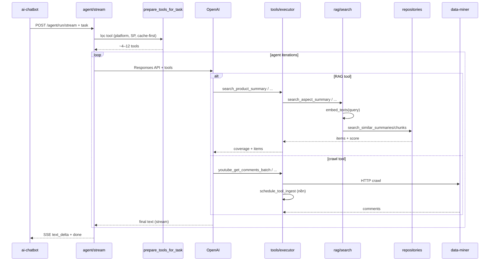
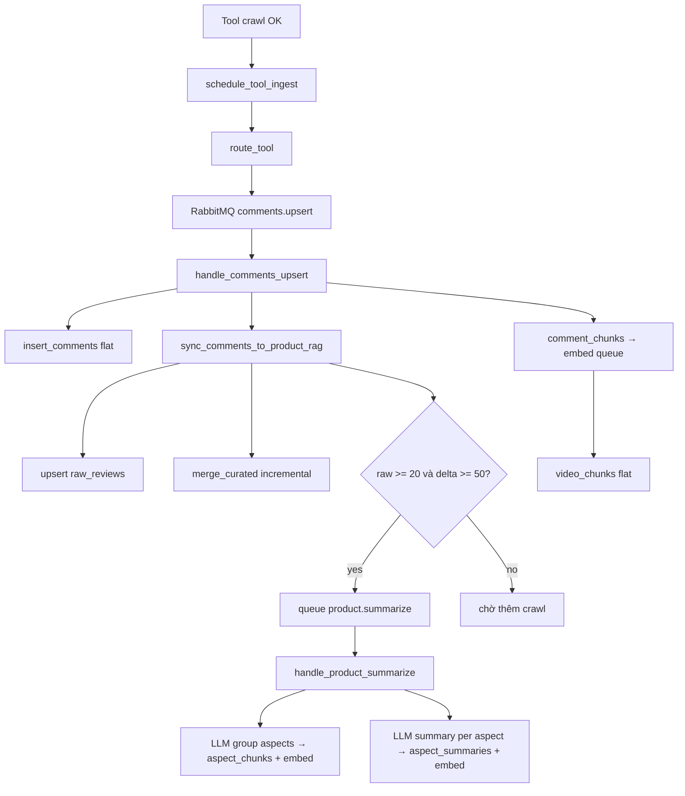

# RAG — Luồng chi tiết (ai-layer)

Tài liệu **trạng thái hiện tại** của pipeline Agentic RAG: đọc khi debug, onboard, hoặc nâng cấp.

Tóm tắt stack: [FLOW.md](./FLOW.md) · Schema/migration: `alembic/versions/`

---

## 1. Mục tiêu

Agent **không** đọc hàng nghìn comment mỗi lần hỏi. Thay vào đó:

1. **L3** — lưu review gốc (YouTube/TikTok) theo `product_id`
2. **Curated** — lọc spam, sort likes, giữ top N
3. **L2** — LLM nhóm curated theo aspect → `aspect_chunks` + embedding
4. **L1** — LLM tóm tắt từng aspect → `aspect_summaries` + embedding

Khi user hỏi, agent gọi tool **L1 trước** → drill-down L2/L3 nếu `coverage` chưa đủ → crawl thêm nếu RAG trống.

**Nguồn review:** chỉ YouTube + TikTok (qua data-miner). Giá Tiki/FPT chatbot nhét vào prompt — **không** ingest TMĐT.

---

## 2. Hai track dữ liệu song song

Mỗi lần crawl comment chạy **hai nhánh** trong `handlers/comments.py`:

| Track | Bảng | Mục đích |
|-------|------|----------|
| **Flat** | `videos`, `comments`, `video_chunks` | Cache video/comment; embed transcript/comment chunks (search phẳng theo video) |
| **Product RAG** | `products`, `raw_reviews`, `curated_reviews`, `aspect_chunks`, `aspect_summaries` | Review theo sản phẩm; agent tool L1/L2/L3 |

```
Crawl comment OK
  ├─ FLAT:  insert_comments → comment_chunks → queue embed → video_chunks
  └─ RAG:   sync_comments_to_product_rag → raw + curated → (đủ điều kiện) queue summarize
```

RAG chỉ chạy khi envelope có **`product_hint`** (tên SP từ task chatbot). Không có hint → chỉ flat track.

---

## 3. Ba tầng retrieval (L1 / L2 / L3)

| Tầng | Bảng | Nội dung | Tool agent | Vector? |
|------|------|----------|------------|---------|
| **L1** | `aspect_summaries` | Tóm tắt pros/cons theo aspect | `search_product_summary` | Có (HNSW) |
| **L2** | `aspect_chunks` | Nhóm review gốc theo aspect | `search_aspect_evidence` | Có (HNSW) |
| **L3** | `raw_reviews` | Comment nguyên văn, sort likes | `get_raw_reviews` | Không |

**Curated** (`curated_reviews`) không phải tầng search — là bước trung gian trước LLM summarize.

**Aspect chuẩn** (dùng trong summarize + tool schema):

`battery`, `camera`, `screen`, `performance`, `design`, `price`, `software`, `durability`, `other`

---

## 4. Sơ đồ end-to-end

### 4.1 Đọc — user hỏi → câu trả lời



### 4.2 Ghi — crawl → RAG đầy đủ



---

## 5. Đọc — chi tiết từng bước

### 5.1 Task từ chatbot

Khi user bấm **AI Review** trên panel sản phẩm, chatbot gửi task có block:

```
[Sản phẩm đang xem]
Tên: iPhone 17 Pro
product_id: iphone-17-pro
Giá: ...
[Câu hỏi hiện tại]
Review sản phẩm này giúp tôi
```

- `extract_product_name()` (`rag/product_hint.py`) lấy tên từ `Tên:` hoặc quote trong câu hỏi
- `slugify_product_id()` (`ingest/mappers/social_review.py`) → `iphone-17-pro`

### 5.2 Lọc tool trước OpenAI — `prepare_tools_for_task()`

File: `app/services/agent/platform.py` — gọi từ `app/services/agent/loop.py` → `bootstrap_agent()`.

Thứ tự lọc:

| Bước | Điều kiện | Kết quả |
|------|-----------|---------|
| 1. Platform | Câu hỏi chỉ nhắc YouTube hoặc TikTok | Bỏ tool nền kia (`youtube_*` / `tiktok_*`) |
| 2. Product context | Có `[Sản phẩm đang xem]` và không chỉ định nền | Thu ~27 tool → **~9** (`_PRODUCT_CORE`) |
| 3. **Cache-first** | `RAG_ENABLED` + có knowledge + còn fresh | Chỉ **4 tool RAG** (`_RAG_CACHE_TOOLS`) |

**Cache-first** (`app/rag/knowledge.py`):

- `product_has_knowledge(product_id)` — có row L1 **hoặc** ≥ 20 curated
- `is_product_fresh(product_id)` — có L1 và `updated_at` trong `CACHE_TTL_DAYS` (mặc định 7 ngày)

→ Agent **không** nhận tool crawl khi RAG đủ và còn mới.

### 5.3 Tool RAG — schema & executor

Định nghĩa: `app/tools/rag_definitions.py`  
Thực thi: `app/tools/executor.py` (khi `RAG_ENABLED=true`)

| Tool | Gọi hàm | Input chính |
|------|---------|-------------|
| `search_product_summary` | `rag/search.search_aspect_summary` | `product_id`, `query`, `aspect?` |
| `search_aspect_evidence` | `rag/search.search_aspect_evidence` | `product_id`, `query`, `aspect?` |
| `get_raw_reviews` | `rag/search.get_raw_reviews` | `product_id`, `limit?` |

### 5.4 Retrieval & `coverage`

File orchestration: `app/rag/search.py`  
Vector SQL: `repositories/aspect_summaries.search_similar_summaries`, `repositories/aspect_chunks.search_similar_chunks`

Luồng L1/L2:

1. `embed_texts([query])` — OpenAI `text-embedding-3-small`, dim = `EMBEDDING_DIM`
2. Cosine search pgvector: `ORDER BY embedding <=> query_vec LIMIT k`
3. Score = `1 - distance`; best score quyết định coverage:

| `coverage` | Ý nghĩa | Agent nên |
|------------|---------|-----------|
| `sufficient` | best score ≥ `RAG_MIN_SCORE` (0.65) | Trả lời từ kết quả |
| `partial` | Có item nhưng score thấp | Gọi L2 hoặc aspect cụ thể |
| `none` | Không có row / không embed | Crawl YouTube/TikTok |

L3: sort `likes DESC`, không vector — `coverage` = `sufficient` nếu có row.

**Gợi ý prompt agent** (Supabase `AGENT_SYSTEM`): L1 → L2 → L3 → crawl khi `none`.

### 5.5 Sau mỗi tool crawl — ingest nền

`app/services/agent/tools.py` → `schedule_tool_ingest()` sau mỗi tool thành công.

`product_hint` = `extract_product_name(task)` (tối đa 120 ký tự).

Tool được route (`ingest/dispatcher/routes.py`):

| Tool | Job RabbitMQ |
|------|----------------|
| `youtube_search`, `tiktok_search` | search cache |
| `youtube_get_comments`, `*_batch` | `comments.upsert` |
| `youtube_get_transcript`, `*_batch` | `transcript.upsert` |
| `tiktok_comments`, `tiktok_transcript` | comments / transcript |
| `youtube_get_detail`, `tiktok_video_info` | `video.upsert` |

---

## 6. Ghi — chi tiết từng bước

### 6.1 RabbitMQ topology

File: `ingest/schemas.py`, `ingest/broker/topology.py`

| Routing key | Queue | Handler |
|-------------|-------|---------|
| `video.upsert` | `ingest.video` | `handlers/video.py` |
| `comments.upsert` | `ingest.comments` | `handlers/comments.py` |
| `transcript.upsert` | `ingest.transcript` | `handlers/transcript.py` |
| `chunks.embed` | `ingest.embed` | `handlers/embed.py` |
| `product.summarize` | `ingest.summarize` | `handlers/summarize.py` |

Exchange: `knowledge.ingest` · DLX: `knowledge.ingest.dlx` · DLQ: `ingest.dlq`

Consumer (`ingest/consumer/worker.py`): retry tối đa 3 lần → reject vào DLQ.

Chạy worker:

```bash
# Cùng process API (dev)
INGEST_WORKER_INLINE=true

# Process riêng
python -m app.ingest
```

### 6.2 `handle_comments_upsert` — dual track

File: `app/ingest/handlers/comments.py`

1. `upsert_video` nếu video chưa có
2. `insert_comments` → bảng `comments` (flat)
3. **`sync_comments_to_product_rag`** (nếu có `product_hint`)
4. `comment_chunks` → publish `chunks.embed` → `video_chunks`

### 6.3 `sync_comments_to_product_rag`

File: `app/ingest/processing/rag_sync.py`

```
product_hint → slugify_product_id
→ upsert products
→ map_social_raw_review (từng comment) → upsert raw_reviews
→ merge_curated(existing, batch_mới)   # incremental, không load 10k raw
→ replace_curated_reviews
→ nếu đủ điều kiện: publish product.summarize
```

**Điều kiện queue summarize** (`_should_queue_summarize`):

- `count(raw_reviews) >= 20` lần đầu, **hoặc**
- Đã có L1 và raw tăng thêm **≥ 50** so với `products.metadata.last_summarize_raw_count`

### 6.4 Curate & quality

| File | Vai trò |
|------|---------|
| `ingest/processing/quality.py` | `is_indexable_comment` — min 6 ký tự, không spam, ≥ 3 alphanumeric |
| `ingest/processing/curate.py` | `curate_review_rows` — lọc + sort likes + top `CURATED_TOP_N` |
| `ingest/processing/curate.py` | `merge_curated` — gộp batch mới với curated hiện có |

### 6.5 `handle_product_summarize` — L2 + L1

File: `app/ingest/handlers/summarize.py`

```
curated_reviews (top CURATED_TOP_N)
  → LLM group aspects (ASPECT_GROUP_* prompts) → aspect_chunks rows
  → embed_texts(chunk content) → upsert aspect_chunks
  → per aspect: LLM summary (ASPECT_SUMMARY_*) → embed summary → upsert aspect_summaries
  → cập nhật products.metadata.last_summarize_raw_count
```

Prompts ingest LLM: `app/services/prompts.py` (`ASPECT_GROUP_*`, `ASPECT_SUMMARY_*`) — **hardcoded repo**, khác `AGENT_SYSTEM` (Supabase).

Fallback: nếu LLM group fail → gom tất cả vào aspect `other`.

### 6.6 Embedding

File: `app/ingest/processing/embeddings.py`

- Model: `EMBEDDING_MODEL` (default `text-embedding-3-small`)
- Dim: `EMBEDDING_DIM` (default `1536`) — khớp `app/db/models/vector_dim.py`
- Batch 64 texts/lần

---

## 7. Schema Postgres

Tất cả qua `DATABASE_URL` (Postgres local). Supabase **chỉ** auth + `config`.

### 7.1 Product RAG

```text
products
  id (PK, slug), name, platform, metadata JSONB

raw_reviews (L3)
  id, product_id FK, source, source_video_id, content, likes, ...

curated_reviews
  id, product_id FK, raw_review_id FK, rank, likes, content

aspect_chunks (L2)
  id, product_id FK, aspect, content, review_ids JSONB, embedding VECTOR

aspect_summaries (L1)
  id, product_id FK, aspect, summary, pros/cons JSONB, embedding VECTOR
  UNIQUE (product_id, aspect)
```

Index HNSW trên `embedding` (cosine) cho L1/L2.

### 7.2 Flat (song song)

```text
videos, comments, video_chunks (embedding), search_cache
chat_sessions, chat_messages
```

### 7.3 Migration (Alembic)

```bash
# DB mới
alembic upgrade head

# DB đã có bảng từ init_db() — một lần
alembic stamp head

# Sau khi đổi models
alembic revision --autogenerate -m "mô tả"
alembic upgrade head
```

Revision hiện tại: `alembic/versions/90c66f03b10a_initial_schema.py`

---

## 8. Config & biến môi trường

| Biến | Default | Ý nghĩa |
|------|---------|---------|
| `RAG_ENABLED` | `true` | Bật tool RAG + executor |
| `RAG_TOP_K` | `8` | Số kết quả vector search |
| `RAG_MIN_SCORE` | `0.65` | Ngưỡng `coverage=sufficient` |
| `CACHE_TTL_DAYS` | `7` | Fresh cho cache-first |
| `CURATED_TOP_N` | `300` | Top curated vào LLM summarize |
| `EMBEDDING_MODEL` | `text-embedding-3-small` | Model embed |
| `EMBEDDING_DIM` | `1536` | Chiều vector |
| `INGEST_ENABLED` | `true` | Publish RabbitMQ |
| `INGEST_WORKER_INLINE` | `true` | Worker trong process API |
| `RABBITMQ_URL` | — | Bắt buộc nếu ingest bật |
| `DATABASE_URL` | — | Postgres + pgvector |

Agent prompt / limits: Supabase bảng `config` (`AGENT_SYSTEM`, `OPENAI_*`, `AGENT_MAX_*`).

---

## 9. File map (theo luồng)

### Đọc (agent query)

| Bước | File |
|------|------|
| Bootstrap agent | `services/agent/loop.py` |
| Lọc tool | `services/agent/platform.py` |
| Cache check | `rag/knowledge.py` |
| Product name | `rag/product_hint.py` |
| Tool schema | `tools/rag_definitions.py` |
| Execute | `tools/executor.py` |
| Orchestration L1/L2/L3 | `rag/search.py` |
| Vector SQL | `repositories/aspect_summaries.py`, `aspect_chunks.py` |
| L3 list | `repositories/raw_reviews.py` |
| Vector literal | `repositories/pgvector.py` |
| Embed query | `ingest/processing/embeddings.py` |

### Ghi (ingest pipeline)

| Bước | File |
|------|------|
| Schedule sau tool | `ingest/dispatcher/schedule.py` |
| Route tool → job | `ingest/dispatcher/routes.py` |
| Publish MQ | `ingest/producer/publisher.py` |
| Consumer | `ingest/consumer/worker.py` |
| Dispatch handler | `ingest/handlers/router.py` |
| Comments dual track | `ingest/handlers/comments.py` |
| RAG sync | `ingest/processing/rag_sync.py` |
| Map comment → L3 | `ingest/mappers/social_review.py` |
| Summarize L2+L1 | `ingest/handlers/summarize.py` |
| Curate / quality | `ingest/processing/curate.py`, `quality.py` |
| ORM | `db/models/product.py` |
| Repos CRUD | `repositories/products.py`, `raw_reviews.py`, `curated_reviews.py`, `aspect_*.py` |

---

## 10. Nâng cấp sau này — điểm mở rộng

### Thêm aspect mới

1. `ASPECTS` trong `ingest/handlers/summarize.py`
2. Mô tả trong `tools/rag_definitions.py` (parameter `aspect`)
3. Cập nhật `ASPECT_GROUP_PROMPT` nếu cần hướng dẫn LLM rõ hơn
4. Re-summarize product: xóa L1/L2 hoặc queue job summarize thủ công

### Điều chỉnh độ “đủ” RAG

| Muốn | Sửa |
|------|-----|
| Dễ coi là đủ knowledge | `product_has_knowledge` — ngưỡng curated (20) |
| Cache lâu hơn | `CACHE_TTL_DAYS` |
| Ít crawl lại | Tăng `_RE_SUMMARIZE_DELTA` trong `rag_sync.py` |
| Summarize sớm hơn | Giảm `_MIN_RAW_FOR_SUMMARIZE` (20) |
| Search nhạy hơn | Giảm `RAG_MIN_SCORE` |

### Thêm nguồn review mới

1. Route tool mới trong `ingest/dispatcher/routes.py` → `publish_comments`
2. Đảm bảo `map_social_raw_review` parse đúng shape comment
3. Không cần đổi L1/L2/L3 nếu vẫn gắn `product_id`

### Đưa ASPECT prompts lên Supabase

Hiện `ASPECT_GROUP_*` / `ASPECT_SUMMARY_*` trong `services/prompts.py`. Pattern giống `AGENT_SYSTEM`: thêm key vào `config/remote.py` `_PROMPT_KEYS`.

### LangGraph / checkpoint (roadmap)

Loop hiện tại: `services/agent/runner.py` + `stream.py` dùng chung `loop.py`. Khi cần branching phức tạp → xem README mục LangGraph.

---

## 11. Debug & kiểm tra

### SQL nhanh

```sql
-- Product có data chưa?
SELECT id, name, metadata FROM products WHERE id = 'iphone-17-pro';

SELECT COUNT(*) FROM raw_reviews WHERE product_id = 'iphone-17-pro';
SELECT COUNT(*) FROM curated_reviews WHERE product_id = 'iphone-17-pro';
SELECT aspect, LEFT(summary, 80), updated_at FROM aspect_summaries WHERE product_id = 'iphone-17-pro';
SELECT aspect, embedding IS NOT NULL AS has_vec FROM aspect_chunks WHERE product_id = 'iphone-17-pro';
```

### API admin

- `GET /ai/admin/ingest/queues` — depth queue RabbitMQ
- `GET /health` — Postgres, Redis, RabbitMQ, data-miner

### Log prefix hay gặp

| Prefix | Ý nghĩa |
|--------|---------|
| `[agent] RAG cache hit` | Cache-first đã thu tool |
| `[rag_sync] queued summarize` | Đủ raw → job L1/L2 |
| `[summarize] done` | L1/L2 ghi xong |
| `[ingest] handler failed` | Consumer lỗi (retry/DLQ) |

### Test unit

```bash
pytest tests/test_core.py tests/test_pgvector.py -q
```

---

## 12. Troubleshooting

| Triệu chứng | Nguyên nhân thường gặp | Cách xử lý |
|-------------|------------------------|------------|
| Agent luôn crawl, không dùng RAG | Chưa có L1/curated; `product_id` sai slug | Kiểm tra SQL; đối chiếu `slugify_product_id` |
| `coverage=none` dù đã crawl | Chưa summarize; embedding NULL | Đợi worker; xem queue `ingest.summarize` |
| `raw_reviews` tăng nhưng không L1 | raw < 20 hoặc chưa đủ delta 50 | Crawl thêm hoặc hạ ngưỡng |
| Cache-first không bật | L1 cũ hơn `CACHE_TTL_DAYS` | Re-summarize hoặc tăng TTL |
| Không có `product_hint` | Task thiếu `[Sản phẩm đang xem]` | Sửa chatbot payload |
| Ingest không chạy | `RABBITMQ_URL` / worker tắt | `INGEST_WORKER_INLINE=true` hoặc `python -m app.ingest` |
| Vector search lỗi | Thiếu extension `vector` | `CREATE EXTENSION vector` trên Postgres |

---

## 13. Quan hệ với các module khác

```text
ai-chatbot          task + [Sản phẩm đang xem] + SSE UI
    ↓
ai-layer /agent     prepare_tools → OpenAI → tools
    ↓ crawl
data-miner          YouTube/TikTok API
    ↓
ai-layer ingest     RabbitMQ → handlers → Postgres
    ↓ query
ai-layer RAG        rag/search → repositories → pgvector
```

**Enricher** (`services/enricher.py`): gắn `sources`, `videos` vào response `done` — **không** tách `review_summary` box; narrative nằm trong bubble agent.

---

*Tài liệu sync với codebase tại nhánh hiện tại. Khi đổi luồng, cập nhật mục 4–6 và file map (mục 9) trước.*
